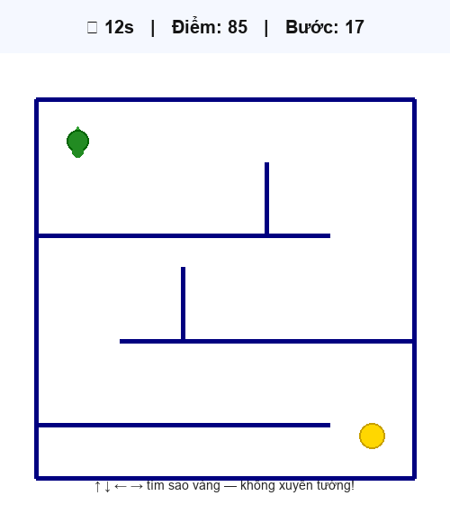

# Hướng dẫn hình ảnh & âm thanh — Game Mê cung 🏰

← [Tổng quan Chương 6](HUONG-DAN-CHUONG-6.md) · Trước: [Né bom](huong-dan-ne-bom.md) · Tiếp: [Đua xe](huong-dan-dua-xe.md)

Dành cho học sinh lớp 6 · Học viện Turtle Python

## Màn hình game thật



↑↓←→ tìm sao vàng · Mỗi bước +5 điểm · Thắng nhanh = thưởng cao

## 1. Cách vẽ mê cung đúng

**Sai (chỉ một đường gấp khúc):**
```python
for dai in [360, 80, 200]:
    tuong.forward(dai)
    tuong.right(90)
```

**Đúng (nhiều bức tường rời):**
```python
DANH_SACH_TUONG = [
    (-180, 180, 180, 180),   # tường ngang
    (180, 180, 180, -180),   # tường dọc
    # ...
]

def ve_tuong(x1, y1, x2, y2):
    tuong.penup()
    tuong.goto(x1, y1)
    tuong.pendown()
    tuong.goto(x2, y2)
```

Cùng list `DANH_SACH_TUONG` dùng để **vẽ** và **va chạm**.

### Va chạm đoạn đi (không xuyên tường)

```python
def cham_tuong(x_cu, y_cu, x_moi, y_moi):
    # Kiểm tra bước cắt ngang tường + điểm mới sát tường
    ...

if cham_tuong(x_cu, y_cu, x_moi, y_moi):
    return  # không goto
```

Truyền cả vị trí **cũ** và **mới** — tránh bước `BUOC` cắt xuyên tường.

## 2. Cấu trúc thư mục

```
games/
├── me-cung.py
├── nen-me-cung.gif   ← nền (tùy chọn)
├── dich.gif          ← đích (tùy chọn)
└── thang.wav         ← âm thắng (tùy chọn)
```

File ảnh/âm đặt **cùng thư mục** với `me-cung.py` (không dùng `os.path`).

## 3. Chạy thử

```bash
cd games
python me-cung.py
```

Phím: **↑ ↓ ← →** · Không xuyên tường · Tìm tới ngôi sao vàng!
